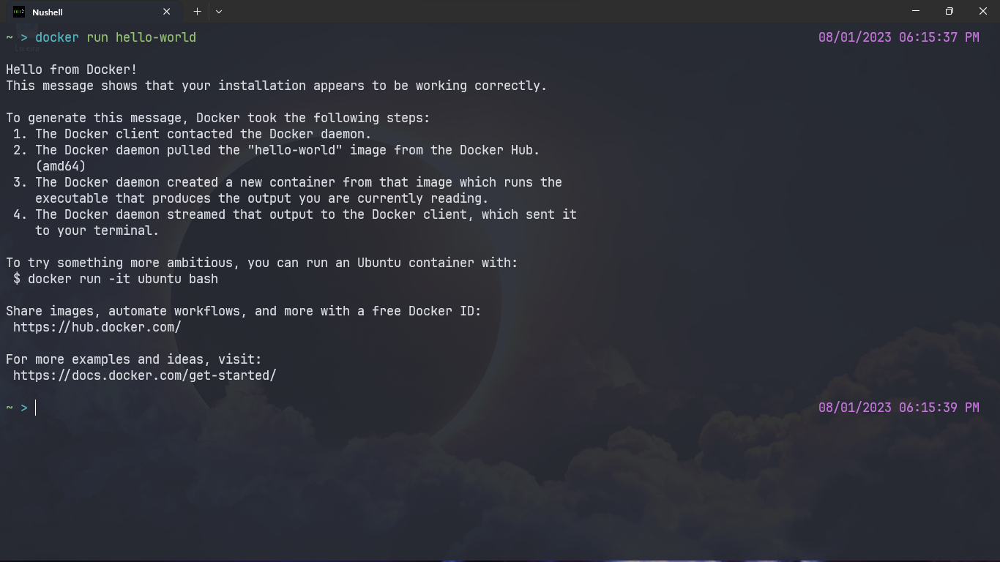

# [M3S04] Ex1

## Instale o Docker em sua máquina e execute a aplicação padrão "Hello Docker"

```bash
// Faz o pull da imagem, baixando ele para a máquina local.
docker pull hello-world

// Após baixar a imagem, instancia ela localmente. (pode-se usar o comando sem ter feito o pull anteriormente que o docker fará o pull automáticamente)
docker run hello-world
```

Imagem da execução:



