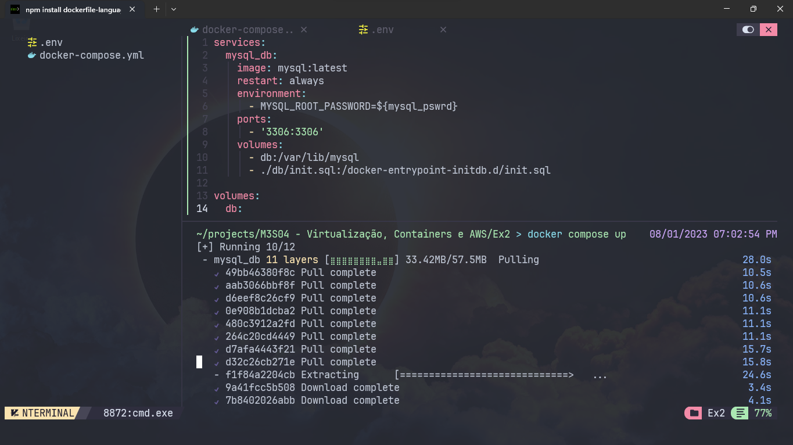
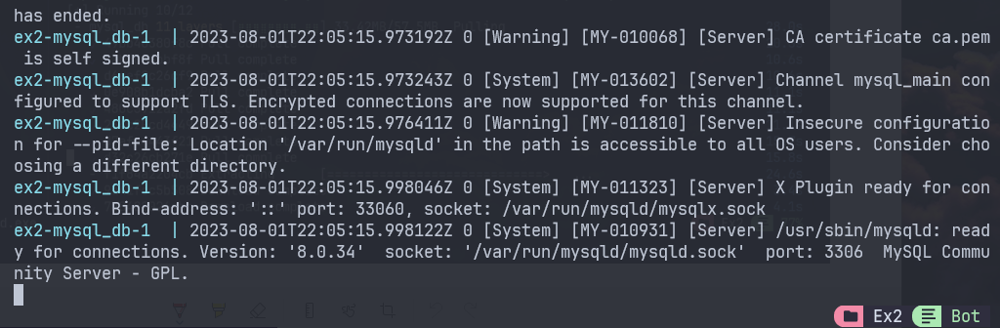
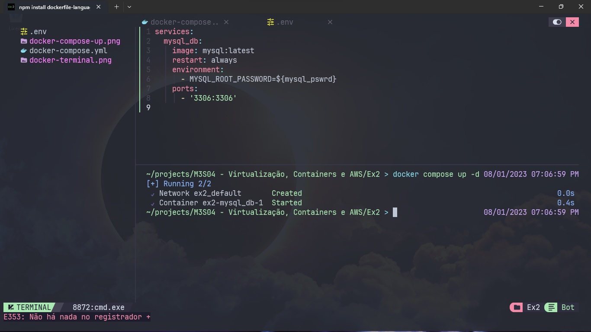

# [M3S04] Ex2 e Ex3

## Ex 2 - Faça o pull da imagem docker oficial do banco relacional MySQL
## Ex 3 - Execute sua imagem docker MySQL 

Fiz o pull e a instanciação através de um docker compose, por isso resolve ambos exercícios.

Seguinto o seguinte arquivo no docker-compose.yml:

```yaml
services: # Serviços que serão instanciados com a imagem.


  mysql_db: # Nome do serviço, pode ser qualquer um.
    image: mysql:latest # Imagem que será baixada para o serviço
    restart: always # Serviço sempre reiniciará quando der algum problema.
    environment: # Variáveis de ambiente do sistema
      - MYSQL_ROOT_PASSWORD=${mysql_pswrd} # Senha do MySQL Root.
    # A senha está dentro de ${} indicando que está pegando uma variável declada no .env (arquivos para variáveis de ambiente)
    
    ports: 
      - '3306:3306' 
      # Porta de execução do serviço: o primeiro é a porta local, o segundo a porta refletida. 
```

O .env tem um arquivo exemplo.

Uma vez com o arquivo docker-compose.yml no diretório, basta utilizar o comando:

```bash
docker compose up
```

Isso já fará o pull e subirá a instância do container.



Dessa forma o terminal retorna a inicialização e a linha de comando do processo.



Para fazer com que o container rode em segundo plano, sem ficar preso na linha de comando:

```bash
# basta adicionar a flag -d
docker compose up -d
```




