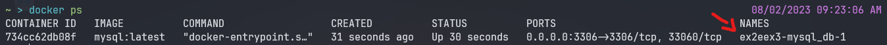

# [M3S04] Ex4

## Valide a sua instância MySQL rodando em docker

1. [Instale o MySQL CLI e Conecte-se a sua instância rodando no docker localmente](Instale o MySQL CLI e Conecte-se a sua instância rodando no docker localmente)
2. Crie uma database
3. Crie uma nova table
4. Insira um novo registro
5. Faça uma query para verificar se todas as etapas funcionaram.

### Instale o MySQL CLI e Conecte-se a sua instância rodando no docker localmente

Para resolver o exercicio sem a necessidade de baixar o MySQL CLI, vamos usar o CLI da própria imagem instanciada do MySQL. Para fazer isso, precisamos saber o nome da imagem que está rodando.

Executaremos o comando "docker ps", para receber os processos do docker que estão instanciados. Dessa forma, teremos o nome do container em processo abaixo da tabela "name":

```bash
docker ps
```



O "nome" está apontado pela seta na imagem.

Uma vez que temos o nome do processo, podemos acessá-lo através do comando docker exec. Para utilizar o CLI do MySQL utilizaremos o seguinte comando: 


```bash
# Após a flag "-it" colocamos o nome do processo, após ela vai ser o comando, para inicializar o MySQL CLI. 
docker exec -it ex2eex3-mysql_db-1 mysql -u root -p
```

Após o comando pedirá para inserir a senha, digite a senha e aperte enter (a senha geralmente não aparecerá sendo escrita).

Uma vez que conseguir fazer a autenticação, você acessará o CLI do MySQL do próprio container.


