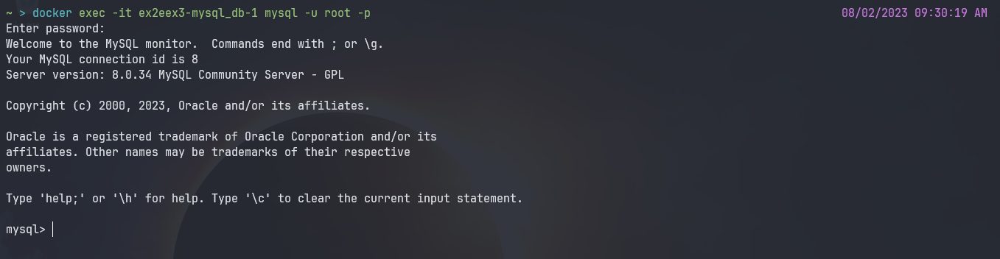
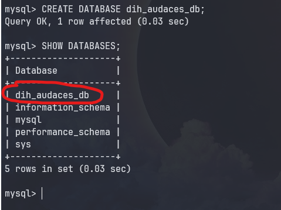
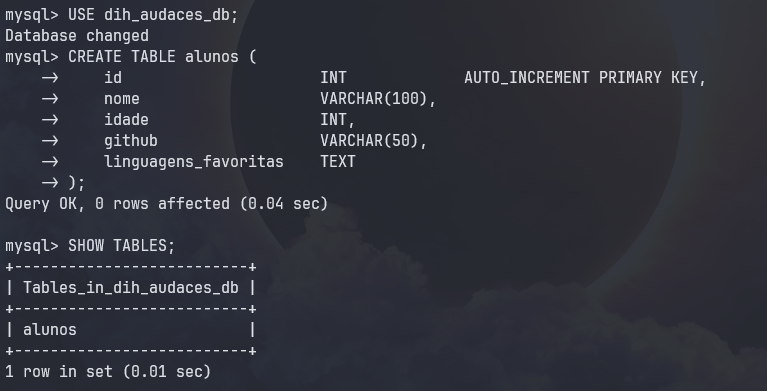
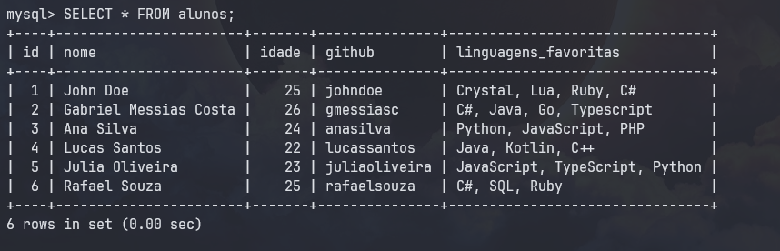

# [M3S04] Ex4

## Valide a sua instância MySQL rodando em docker

1. [Instale o MySQL CLI e Conecte-se a sua instância rodando no docker localmente](#1-instale-o-mysql-cli-e-conecte-se-à-sua-instância-rodando-no-docker-localmente)
2. [Crie uma database](#2-crie-uma-database)
3. [Crie uma nova table](#3-crie-uma-nova-table)
4. [Insira um novo registro e fazer query para verificar](#4-insira-um-novo-registro-e-fazer-query-para-verificar)

### 1. Instale o MySQL CLI e Conecte-se à sua instância rodando no docker localmente

Para resolver o exercicio sem a necessidade de baixar o MySQL CLI, vamos usar o CLI da própria imagem instanciada do MySQL. Para fazer isso, precisamos saber o nome da imagem que está rodando.

Executaremos o comando "docker ps", para receber os processos do docker que estão instanciados. Dessa forma, teremos o nome do container em processo abaixo da tabela "name":

```bash
docker ps
```


O "nome" está apontado pela seta na imagem.

Uma vez que temos o nome do processo, podemos acessá-lo através do comando docker exec. Para utilizar o CLI do MySQL utilizaremos o seguinte comando: 


```bash
# Após a flag "-it" colocamos o nome do processo, após ela vai ser o comando, para inicializar o MySQL CLI. 
docker exec -it ex2eex3-mysql_db-1 mysql -u root -p
```

Após o comando pedirá para inserir a senha, digite a senha e aperte enter (a senha geralmente não aparecerá sendo escrita).

Uma vez que conseguir fazer a autenticação, você acessará o CLI do MySQL do próprio container.




### 2. Crie uma database

Uma vez acessado o CLI do MySQL, basta realizar os comandos SQL normalmente no CLI. 

Para criar uma database: 

```mysql
CREATE DATABASE dih_audaces_db;
```
O nome da nossa database é "dih_audaces_db". Podemos verificar isso com o comando:

```mysql
SHOW DATABASES;
```

Como podemos ver no print abaixo: 



### 3. Cria uma nova table 

Primeiramente usaremos o USE para selecionar a database que usaremos: 

```mysql 
USE dih_audaces_db;
```

Em seguida basta fazer o comando para criar a tabela com suas respectivas colunas:

```mysql
CREATE TABLE alunos (
    id                      INT             AUTO_INCREMENT PRIMARY KEY,
    nome                    VARCHAR(100),
    idade                   INT,
    github                  VARCHAR(50),
    linguagens_favoritas    TEXT
);
```

Para verificar se a tabela foi devidamente criada, podemos usar o comando abaixo: 

```mysql
SHOW TABLES;
```



### 4. Insira um novo registro e fazer query para verificar

Basta fazer um comando de insert para adicionar o registro na tabela: 

```mysql
INSERT INTO alunos (nome, idade, github, linguagens_favoritas)
VALUES 
    ('John Doe', 25, 'johndoe', 'Crystal, Lua, Ruby, C#'),
    ('Gabriel Messias Costa', 26, 'gmessiasc', 'C#, Java, Go, Typescript'),
    ('Ana Silva', 24, 'anasilva', 'Python, JavaScript, PHP'),
    ('Lucas Santos', 22, 'lucassantos', 'Java, Kotlin, C++'),
    ('Julia Oliveira', 23, 'juliaoliveira', 'JavaScript, TypeScript, Python'),
    ('Rafael Souza', 25, 'rafaelsouza', 'C#, SQL, Ruby');
```

Após isso, fazer uma query simples para verificar se os dados foram adicionados na tabela: 

```mysql
SELECT * FROM alunos;
```




