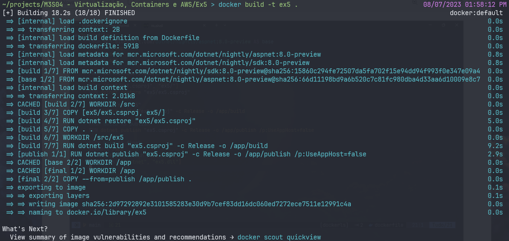
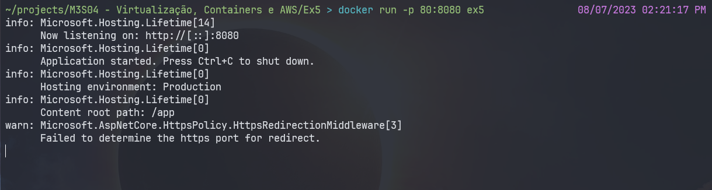
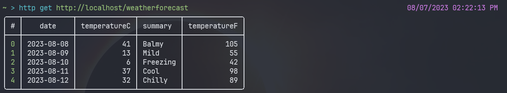

# [M3S05] Ex5

## Crie sua primeira imagem Docker

1. [Crie uma imagem de sua aplicação](#1-Crie-uma-imagem-de-sua-aplicação)
2. [Teste sua execução localmente](#2-teste-sua-execução-localmente.)

### 1. Crie uma imagem de sua aplicação

Criaremos primeiro o docker file para a containerização:

```Dockerfile
# Fazendo o runtime com a base da imagem preview do aspnet.
FROM mcr.microsoft.com/dotnet/nightly/aspnet:8.0-preview AS base
WORKDIR /app
EXPOSE 80 
# expondo a porta 80
EXPOSE 443 
# expondo a porta 443

# Utilizando a SDK para buildar a aplicação, através da imagem preview 
FROM mcr.microsoft.com/dotnet/nightly/sdk:8.0-preview AS build
WORKDIR /src
COPY ["ex5/ex5.csproj", "ex5/"] 
# copiando a pasta ex5 para a pasta ex5/

RUN dotnet restore "ex5/ex5.csproj" 
# baixando as dependencias do projeto

COPY . .
WORKDIR "/src/ex5" 
RUN dotnet build "ex5.csproj" -c Release -o /app/build 
# fazendo a release do projeto

FROM build AS publish
RUN dotnet publish "ex5.csproj" -c Release -o /app/publish /p:UseAppHost=false

FROM base AS final
WORKDIR /app
COPY --from=publish /app/publish .
ENTRYPOINT ["dotnet", "ex5.dll"] 
# iniciando a aplicação já publicada

```

Uma vez com o Dockerfile explicitado, basta usar o comando:


```bash
docker build -t ex5 .
```

A flag "-t" infere o nome do container, enquanto o . indica o caminho que existe o dockerfile.



### 2. Teste sua execução localmente

Uma vez que o projeto está containerzado, podemos utilizar o seguinte comando para rodar o container:

```bash
docker run -p 80:8080 ex5
```

Com esse código, estou expondo a porta 80 (http padrão) da minha máquina para redirecionar a porta 8080 da imagem.



Poderia ter adicionado a flag -d para rodar a aplicação em segundo plano também.

Para testar a aplicação, podemos acessar a porta: http://localhost/weatherforecast

Usarei o nushell para verificar se retorna corretamente:

```nushell
http get http://localhost/weatherforecast
```


